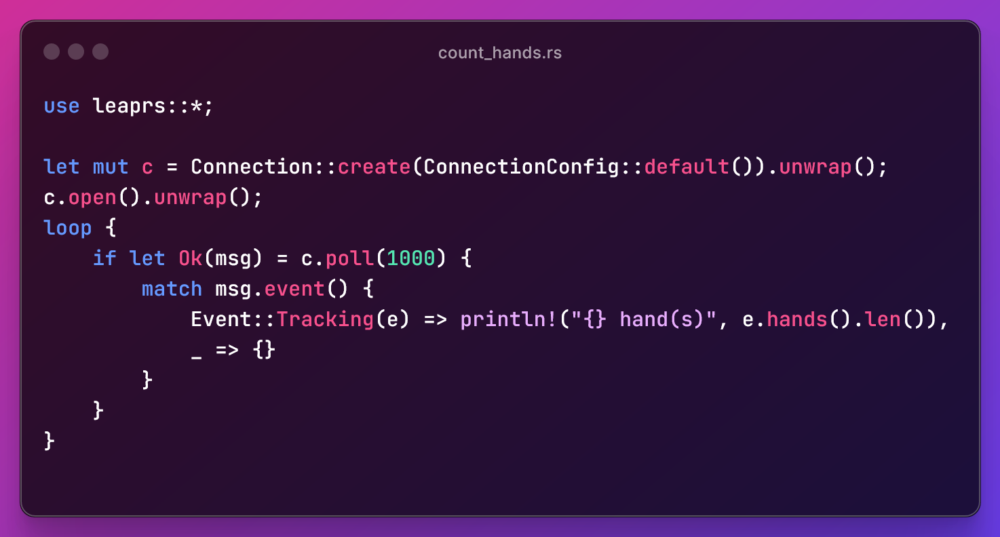

# LeapRS

[](https://github.com/plule/leaprs)
[](https://crates.io/crates/leaprs)
[](https://docs.rs/leaprs)


LeapRS is a safe wrapper for LeapC, the [Leap Motion C
API](https://docs.ultraleap.com/tracking-api/). It uses the generated binding
provided by [leap-sys](https://crates.io/crates/leap-sys).

This is an API for accessing Leap Motion/Ultraleap hand tracking device. It
works on Linux and Windows.



<div class="example-wrap" style="display:inline-block"><pre class="compile_fail" style="white-space:normal;font:inherit;">

**Warning**: This library is not complete and not fully tested. Moreover, it includes unsafe
code to interact with the C API. It should be treated with caution in its
current state.

</pre></div>

## Scope

The goal of LeapRS is to cover entirely LeapC in a safe way. It is intended to
be as close as possible to the original C library. As such, it's fairly low
level and carries most of the difficulties of using LeapC.

It is not intended to provide any full featured framework such as having a
worker thread and provide an async API. It is intended to be usable to create
such framework though.

### API Coverage

The current coverage includes most of the necessary functions to interact with a
Leap Motion device in a single or a multi device environment. The interpolation
and distortion methods are not fully translated and not fully tested.

The allocation API is not exposed.

## Installation

`cargo add leaprs`

You also need to install the [LeapMotion Tracking
Software](https://developer.leapmotion.com/tracking-software-download).

This library was created for the version named `Geminy` (5.6.1).

If you install this software in a custom path, you need to define the
environment variable `LEAPSDK_LIB_PATH` (default: `C:\Program
Files\Ultraleap\LeapSDK\lib\x64` on Windows and
`/usr/share/doc/ultraleap-hand-tracking-service` on Linux).

### Using with previous SDK versions

Disabling the `geminy` feature enables building application for the previous SDK
generation (Orion). In Cargo.toml:

```toml
[dependencies = { version = "*", default-features = false }]
```

You also need to point the `LEAPSDK_LIB_PATH` to a SDK with the Orion version.

## Runtime

At runtime, the application requires the LeapC.dll file to be available. The
easiest way to do it during development is to add its folder to the `PATH`
environment variable. For distribution, refer to the SDK licensing.

## Quick start

```rust
use leaprs::*;

let mut c = Connection::create(ConnectionConfig::default()).unwrap();
c.open().unwrap();
for _ in 0..10 {
    if let Ok(msg) = c.poll(1000) {
        match msg.event() {
            Event::Tracking(e) => println!("{} hand(s)", e.hands().len()),
            _ => {}   
        }
    }
}
```

## `glam` and `nalgebra` Integration

`leaprs` includes opt-in `glam` and `nalgebra` integrations.

They are two popular linear algebra library. Both are commonly used, and these features can help integrating with ecosystem using these crates.
`glam` is used by `Bevy`, and `nalgebra` is used by `Fyrox`.

### glam

`cargo build --features glam`

```rust
use leaprs::*;
use glam::{Vec3, Quat};

let mut c = Connection::create(ConnectionConfig::default()).unwrap();
c.open().unwrap();
for _ in 0..10 {
    if let Ok(msg) = c.poll(1000) {
        match msg.event() {
            Event::Tracking(e) => {
                for hand in e.hands() {
                    let position: Vec3 = hand.palm().position().into();
                    let orientation: Quat = hand.palm().orientation().into();
                }
            },
            _ => {}
        }
    }
}
```

### nalgebra

`cargo build --features nalgebra`

```rust
use leaprs::*;
use nalgebra::{Vector3, UnitQuaternion};

let mut c = Connection::create(ConnectionConfig::default()).unwrap();
c.open().unwrap();
for _ in 0..10 {
    if let Ok(msg) = c.poll(1000) {
        match msg.event() {
            Event::Tracking(e) => {
                for hand in e.hands() {
                    let position: Vector3<f32> = hand.palm().position().into();
                    let orientation: UnitQuaternion<f32> = hand.palm().orientation().into();
                }
            },
            _ => {}
        }
    }
}
```

## License

Licensed under either of Apache License, Version 2.0 or MIT license at your option.

This license only covers the `leaprs` wrapper, and not the underlying `LeapC` library.

## Implementation

The enum safety is provided through [num_enum](https://docs.rs/num_enum/latest/num_enum/).

The bitflags are wrapped using [bitflags](https://docs.rs/bitflags/latest/bitflags/).

Most struct are simple wrappers around their C counter-part. Most of the time,
the C struct is the only member of the wrapper, except when external allocation
is needed (when providing a pre-allocated array to LeapC). Accessors are then
exposing all the functions and members associated with these structs in a
consistent way.

## Tests

The test require to have the Leap software up and running, and to have a device
connected.
